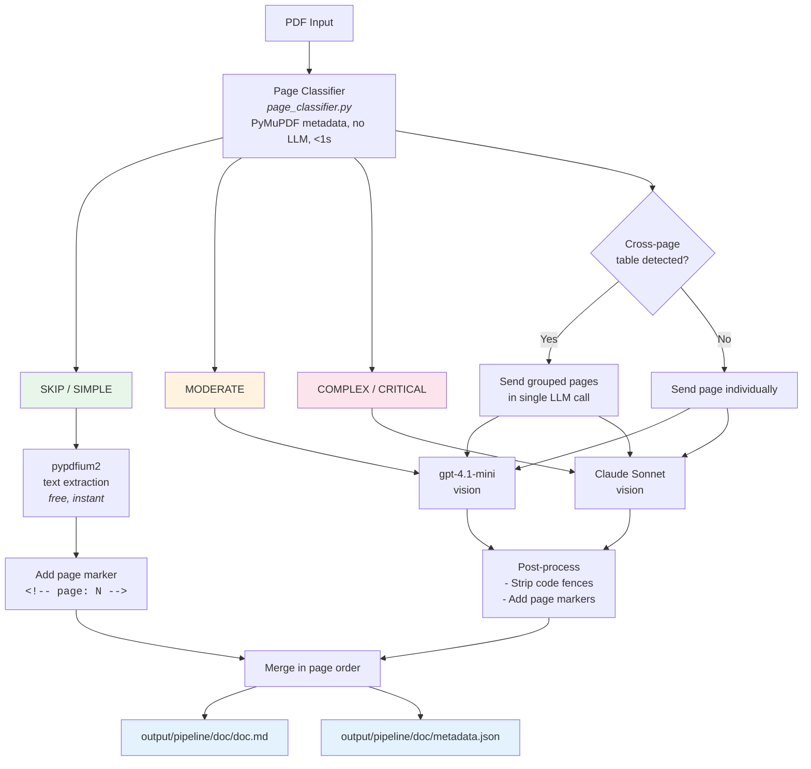
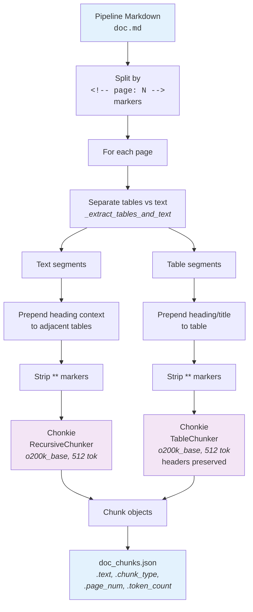
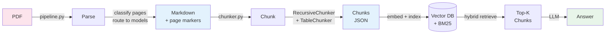

# Architecture Diagrams

## 1. PDF Parsing Pipeline



## 2. Chunking Pipeline



## 3. Evaluation Pipeline

```mermaid
flowchart TD
    PDF[PDFs] --> LoadMD[Load markdown<br><i>cached or --force-parse</i>]
    QA[qa_pairs.json] --> Eval

    LoadMD --> Eval[For each chunker strategy]

    Eval --> C1[page_level]
    Eval --> C2[fixed_512_overlap]
    Eval --> C3[recursive]
    Eval --> C4[heading_based]
    Eval --> C5[table_aware]
    Eval --> C6[element_type]
    Eval --> C7[semantic]
    Eval --> C8[structure_aware]
    Eval --> C9[chonkie_512]

    C1 & C2 & C3 & C4 & C5 & C6 & C7 & C8 & C9 --> ChunkEmbed[Embed chunks<br><i>text-embedding-3-small</i><br>+ Build BM25 index]

    ChunkEmbed --> Retrieve[For each question:<br>Hybrid retrieve top-k<br><i>dense + BM25 RRF</i>]

    Retrieve --> Metrics[Compute metrics]

    Metrics --> Recall[Recall@1,3,5,10<br><i>keyword in top-k chunks</i>]
    Metrics --> MRR[MRR<br><i>rank of first chunk<br>with keyword</i>]
    Metrics --> LLMEval[LLM Answer Eval<br><i>--llm-eval flag</i><br>gpt-4.1-mini answers<br>from top-5 chunks]

    Recall & MRR & LLMEval --> Results

    Results --> JSON[results_{ts}.json]
    Results --> CSV[summary_{ts}.csv]
    Results --> Details[details_{ts}/<br>per-strategy per-doc<br>with retrieved chunks]
    Results --> Comparison[CHUNKING_COMPARISON.md]

    style C9 fill:#f3e5f5
    style LLMEval fill:#fff3e0
    style JSON fill:#e3f2fd
    style CSV fill:#e3f2fd
    style Details fill:#e3f2fd
```

## 4. End-to-End Flow


